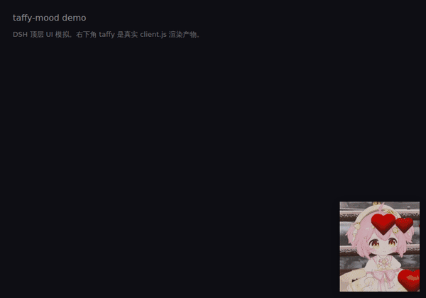

# taffy-mood — A Mood State Machine for DeepSeek Harness

[中文简体](README.md) | English

A standard DSH plugin that pins a Taffy mood mascot in the bottom-right corner of the DeepSeek Harness Web UI. The GIF reacts live to agent state — approval pending, thinking, tool runs, interrupts, errors and more — each with its own expression. One-line install, assets bundled, no build step.



## Install

```sh
dsh plugin --profile web add github:vegetable-kun/DSH_Plugin_Taffy
```

Then restart `dsh web`. The installer auto-registers the package in your profile's bundle list — no manual config needed.

<details>
<summary><b>Mood reference (click to expand)</b></summary>

## Mood description

| Mood | Asset | Trigger |
|---|---|---|
| Idle | `taffy2-idling` | Default fallback |
| Typing | `taffy-se_xy` | Composer has unsent draft text |
| Thinking | `taffy-dumb` | Model is streaming |
| Tool running | `taffy-tang-laughing` | `tool/call` is active |
| Awaiting approval | `taffy-fork` | An approval request pops up (pulsing animation) |
| Approved! | `taffy-spread_heart` | 3 s after approval |
| Hacker | `taffy-hacker` | While executing an approved task; clears when the turn ends |
| Embarrassing | `taffy-embarrassing` | Persists after rejection until you start typing |
| User aborted | `taffy-angry` | `turn/end` reason=aborted, 5 s |
| Error / max-tokens | `taffy-suicide` | `turn/end` reason=error or max-tokens, 5 s |
| Interjection! | `taffy-suprised` | User messages while model is still streaming / working, 4 s |
| Blocked | `taffy-cry` | `turn/end` reason=blocked, 6 s |
| Proud | `taffy-admirable` | A turn finishes after ≥5 tool calls, 4 s |
| Fake crying | `taffy-fake_crying` | Two consecutive rejected approvals, 5 s |
| Begging | `taffy-begging` | Second approval request within 60 s, 5 s window then falls back to fork |
| Awaiting answer | `taffy-staring` (static) | An `ask_user_question` call is pending; clears on user reply |
| Compacting memory | `taffy-pressure` (static) | `compaction/start` → `end` (with 90 s safety net) |
| Long-task fatigue | `taffy-angry_staring` (static) | A turn runs longer than 3 min, clears on `turn/end` |
| Ignored approval | `taffy-cry_denying` | An approval sits idle for more than 30 s, clears on decision |
| Sleeping | `taffy4` (static) | Idle for more than 10 min, saves GIF decoding; any activity wakes it |
| Greeting | `tafei` (static) | 2 s hello when the page loads; never blocks real moods |

Priority chain: lock > begging (time-boxed) > awaiting answer > compacting > ignored approval > approval pending > approval celebration > surprised > crying > aborted / error / fake-crying flash > proud > fatigue > running (hacker / thinking / tool) > typing > greeting (2 s) > sleeping > idle. Every state has a clear exit: begging is a time-box, awaiting answer is cleared by reply / matched result / turn end, compacting is bounded by `end` plus a 90 s safety net, fatigue and ignored-approval are time-derived and disappear on the next event, so no state can permanently block lower ones.

</details>

## Usage

- **Left-drag** to reposition; **middle-click** opens the floating console; right-click is a fallback.
- The console shows a live status badge, lets you lock any mood (for debugging), run a test approval, and reset the position.
- Settings → **Taffy 表情**: enable toggle, size (50–1000 px), opacity, click-through, and a **today's mood-time summary**.
- Appearance settings persist in the browser's `localStorage` under `dsh-taffy-mood/settings`; they survive page refresh.

## Uninstall / disable

```sh
dsh plugin --profile web remove dsh-taffy-mood   # remove from profile
# or just untick "启用表情" in settings to hide it
```

## Configuration

Per-mood time thresholds are read from `~/.dsh/profiles/web/cordis.patch.yml` — add a `config` block to the `dsh-taffy-mood` row (snake_case, only override what you want):

```yaml
- id: dsh-taffy-mood
  config:
    surprised_ms: 6000          # interjection window 6 s (default 4000)
    ignored_after_ms: 60000     # ignored-approval 60 s (default 30000)
    sleep_after_ms: 600000      # sleep after 10 min (default 600000)
    tired_after_ms: 300000      # fatigue after 5 min (default 180000)
    # turn_flash_ms / crying_ms / admirable_ms / begging_window_ms / begging_show_ms / compacting_failsafe_ms — same idea
```

Omitted fields keep the default; invalid values (negative, non-number) are ignored and fall back to the default.

## Structure & technical notes

```
package.json       dsh.bundle.patch + dsh.client.platform: "web"
cordis.patch.yml   - insert: dsh-taffy-mood
host.js            Host half: session/event state machine + bundled assets + JSON API
client.js          Client half: __ModuleLoader__-wrapped overlay / console / settings panel
assets/            All assets (15 in-use GIFs + spare JPGs)
test/smoke.mjs     Smoke test: `node test/smoke.mjs`
test/client-act.mjs Client-side unit test for action URL shape
```

- The host subscribes to `ctx.on('session/event')` and drives the state machine off log audit events (`approval/*`, `tool/*`, `turn/*`, `assistant/chunk`, `user/message`, `compaction/*`); running state is read live from the agents registry (event counts miss agents that were already running at plugin activation).
- The browser side polls `/dsh-taffy-mood/api/state` and posts actions to `/api/action` (lock / clear-rejected / test-approve); assets are served from `/dsh-taffy-mood/assets/*` with a content-hash whitelist route and an in-memory cache.
- Write actions are strictly POST-only with an Origin check (only `127.0.0.1` / `localhost` loopback, or a missing Origin for local tools) — prevents cross-origin pages from triggering approval cards via `` tags.
- Polling cadence is demand-driven: 300 ms when a mood is active, 2 s when idle, and time-windowed when a time-bounded state is about to expire.
- Interjection detection: tool-call in progress **or** a chunk within 2.5 s — avoids false positives on the very first poll of a new turn.
- Typing detection uses the official `conversation.composer.dock` InputZone's `props.input.draft` (no key listeners).
- Per-mood time thresholds can be overridden via the `config:` block in `~/.dsh/profiles/web/cordis.patch.yml` (snake_case), e.g. `surprised_ms: 6000` / `sleep_after_ms: 600000`.
- Assets are content-hashed for permanent caching (`max-age=31536000, immutable`); URLs look like `/assets/taffy-cry.a1b2c3d4.gif` — new package version ⇒ new URL ⇒ no stale cache, and old URLs redirect with 301 for compat.
- Pure ESM host + `__ModuleLoader__`-wrapped client, no build step, no npm dependencies — clone the repo and you have the running source.

欢迎提 issue 和 PR — if you like it, a free ⭐ would be lovely.


## License

MIT
